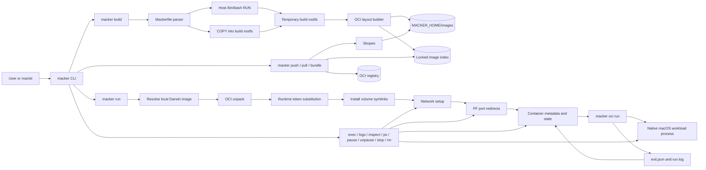
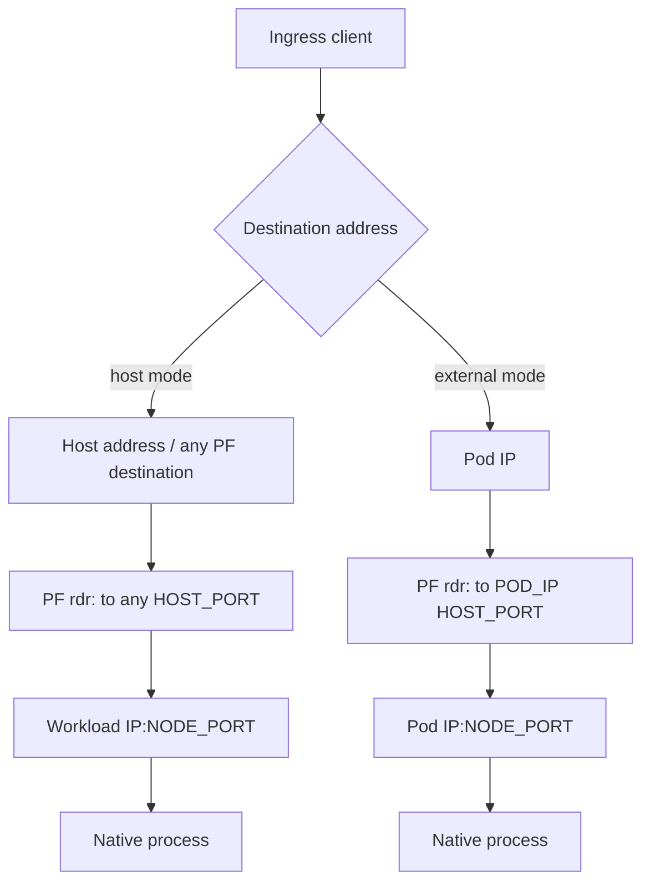
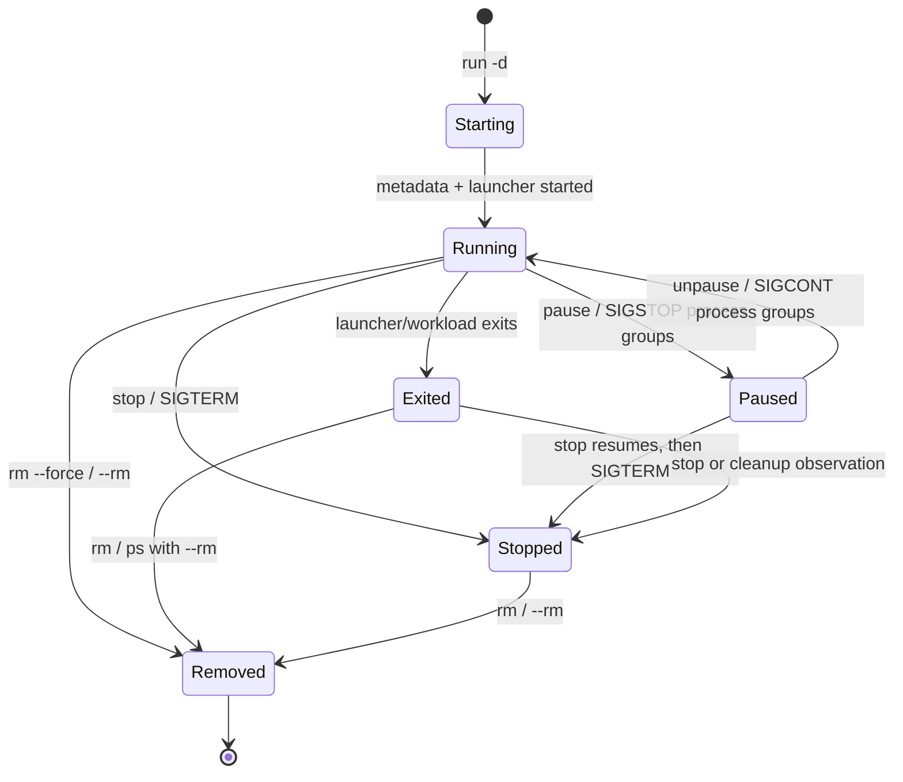

# Macker architecture

Macker is an experimental OCI workload tool for running native macOS
Mach-O programs on Apple Silicon. It uses OCI images as a distribution and
packaging format, but it is **not** a Linux container runtime and does not
provide a security boundary.

Macker's product boundary is deliberately small:

- build a trusted Darwin workload into a local OCI layout;
- push, pull, and combine Darwin manifests with ordinary multi-platform images;
- materialize an independent per-container rootfs and run the native workload;
- provide enough host networking, port publishing, lifecycle state, logs, and
  `exec` support for a maclet-managed Kubernetes node.

## System overview

The CLI is a single Go binary. High-level commands coordinate images, rootfs
materialization, host networking, PF, and persistent state. The lower-level
`macker oci` commands operate directly on OCI layouts and are also used by the
high-level runtime.



The arrows represent coordination, not isolation. A workload remains an
ordinary host process with host-visible process, filesystem, and network
resources.

## Main components

### CLI and command layers

`cmd/macker/main.go` owns command dispatch, high-level build/registry/runtime
orchestration, persistent state, container metadata, and lifecycle operations.
`cmd/macker/oci.go` owns the low-level OCI layout reader/writer, image selection,
unpack, command resolution, and native process execution. `cmd/macker/network.go`
contains Darwin interface setup and cleanup. `cmd/macker/ports.go` allocates
automatic workload-side ports.

The high-level runtime invokes the same executable again for detached workloads:

```text
macker run -d ...
  -> macker oci run --skip-unpack --rootfs ...
       -> resolved native command
```

This keeps the process that owns the workload's wait status, stdout/stderr
capture, signal forwarding, and exit record separate from the CLI invocation
that created the container.

### Build path

A Mackerfile is intentionally Dockerfile-like but supports only a small subset:

- `FROM scratch`
- `RUN`
- `COPY`
- `ENV`
- `WORKDIR`
- JSON-array `ENTRYPOINT` and `CMD`
- metadata-only `EXPOSE`

Build steps are applied in order to one temporary rootfs. `RUN` executes
`/bin/bash -c` on the host, using the build context as its working directory.
It receives `MACKER_CONTEXT`, `MACKER_ROOTFS`, the host environment, and image
build environment values. It can therefore read or modify anything available to
the invoking user and must be treated as trusted build code.

`COPY` sources are constrained to the build context, while destinations must be
absolute paths in the image rootfs. The resulting image currently contains one
uncompressed tar layer plus its OCI config and manifest metadata; Macker does
not implement general Docker layer caching, multi-stage builds, or a non-scratch
base image.

### OCI and registry path

Local images are stored below `${MACKER_HOME:-$HOME/.macker}/images`, keyed by
normalized image reference. A locked state index records known images. Macker
uses Skopeo for registry authentication and transfer, so credentials come from
Skopeo's normal credential stores (with `REGISTRY_AUTH_FILE` available as an
override).

`pull` selects the native `darwin/arm64` manifest from a multi-platform image.
`bundle` recursively flattens source indexes, preserves their non-Darwin
platform descriptors, replaces any existing Darwin/arm64 descriptor, and can
push the merged index. Platform-specific entrypoints, arguments, environments,
and behavior are not reconciled by bundling.

The local OCI loader verifies referenced blob sizes and SHA-256 digests before
using descriptor JSON. Low-level OCI commands accept layout directories rather
than Docker daemon image names.

## Runtime path

A high-level `run` performs these phases before launching the workload:

1. Parse and validate networking, environment, volume, entrypoint, and publish
   options.
2. Resolve the image. `scratch` and `scratch:latest` are local sentinels: Macker
   creates/reuses a minimal empty Darwin OCI layout under its temporary state
   directory and never pulls or registers it as a user image.
3. Resolve `NODE_PORT=auto` or `NODE_PORT=0` mappings. Automatic ports are
   selected randomly from `30000-32767`, avoiding live Macker mappings and
   currently bindable host TCP/UDP ports.
4. Check published host-port conflicts. External target-IP mappings may reuse a
   host port when their target Pod IPs differ; host-mode mappings reserve the
   port globally.
5. Create or validate the requested network.
6. Unpack the selected Darwin image into a fresh container rootfs.
7. Merge image and run environment values, then substitute `____MACKER_*____`
   tokens in recognized regular UTF-8 configuration files.
8. Install volume mappings as host-path symlinks.
9. Install PF redirects for published ports.
10. Persist metadata and launch the OCI process.

The stored image layout is never used as a writable container rootfs. Each run
gets its own materialized rootfs, so runtime mutations do not modify the image.
The current materialization is a copy/unpack operation; it is not an overlay
filesystem and does not provide copy-on-write isolation.

### Native execution

`macker oci run` loads the image config, selects the Darwin/arm64 workload,
resolves its entrypoint and arguments, sets the configured environment and
working directory, and launches the native Mach-O command. Non-chroot mode
runs from the extracted rootfs directory while retaining the host's process,
filesystem, and network view. An explicit runtime entrypoint may use a host
executable fallback for debugging when the command is absent from the image.

The experimental `--chroot` option changes the child filesystem root only. A
usable Darwin chroot needs a compatible dyld/system-library environment, and
macOS chroot is not treated as process or filesystem isolation. The normal
Macker path is therefore non-chroot native execution. Scratch runs have no
image entrypoint, command, or files; the high-level runtime allows the trusted
host-command fallback so `/bin/sh`, an explicit entrypoint, or a
volume-mounted executable can be used against the empty rootfs.

### Pause and unpause

Detached workloads can be suspended without tearing down their runtime
resources. `macker pause NAME` sends `SIGSTOP` to the workload's process group
and any tracked exec process groups, persists `PausedAt`, and leaves the
materialized rootfs, volume links, PF mappings, and network configuration in
place. `macker unpause NAME` sends `SIGCONT` and clears `PausedAt`. `ps` and
`inspect` report `paused`, while reconciliation deliberately does not clean up
paused resources. This is best-effort process-group control: a workload that
creates a new session can escape the tracked group, and no namespace or
resource-limit isolation is implied. Before signaling, Macker validates the
recorded launcher/workload PID start times to reduce PID-reuse risk. Missing or
mismatched identity fails without changing the persisted paused state; signal
or metadata failures attempt to roll back the process state. `stop` remains
separate and resumes a paused workload before terminating it and cleaning its
PF/network resources.

The pause path does not replay or reconstruct the original invocation. A
future restart operation will need persisted command/entrypoint configuration
and separate desired-network metadata.

## Networking and port publishing

Macker has two network modes:

- **Host mode** creates or reuses `bridge88` at `172.31.88.1/24` and allocates
  an owned per-container interface such as `bridge881` at `172.31.89.1/24`.
  These are host-side plumbing primitives with no network namespaces or
  bridge members. The native process still shares the host network stack.
- **External mode** validates an already-existing interface and canonical IPv4
  Pod IP, such as a VXLAN bridge managed by maclet. Macker does not create,
  destroy, or claim that interface. Optional host interface/IP identity can be
  supplied for environment and PF context.

Both modes inject:

```text
MACKER_INTERFACE
MACKER_IP
MACKER_HOST_INTERFACE
MACKER_HOST_IP
MACKER_PORT_1
MACKER_PORT_2
...
```

The numbered port values are workload-side listening ports. Workloads are
expected, but cannot be forced, to bind to their supplied IP and ports.



Publishing uses Docker-style `-p HOST_PORT:NODE_PORT[/tcp|/udp]`. The protocol
defaults to TCP. `auto` and `0` are accepted for `NODE_PORT`; the resolved
value is persisted and can be read from `macker inspect --format json`.

Host mode retains the compatibility rule:

```text
rdr pass inet proto tcp from any to any port = 8080 -> 172.31.89.1 port 30080
```

External mode uses a target-specific destination:

```text
rdr pass inet proto tcp from any to 10.42.8.3 port = 8080 -> 10.42.8.3 port 31543
```

Macker loads rules into one hashed child anchor per container beneath
macOS's existing `com.apple/*` dynamic anchor. New anchors use the form:

```text
com.apple/macker-<32 hex SHA-256 characters>
```

The generated anchor is stored in container metadata so cleanup remains
possible even when the container name is long. PF is enabled with a retained
enable token and cleaned on stop, removal, foreground completion, setup
failure, or `ps` reconciliation. Macker does not replace the main PF ruleset.

PF publishing is IPv4-only, ingress-oriented, and global host configuration;
a same-Mac request to a published address may not traverse the same path as a
remote ingress request.

## Persistent state and lifecycle

The default state root is `${MACKER_HOME:-$HOME/.macker}`:

```text
.macker/
├── images/
│   └── <normalized-reference-hash>/
├── containers/
│   └── <name>/
│       ├── rootfs/
│       ├── metadata.json
│       ├── exit.json
│       ├── workload.pid         # while the native workload is running
│       ├── run.log              # detached workloads
│       └── exec/*.pid           # tracked detached exec children
├── state.json
└── state.lock
```

`state.json` is versioned and contains image and container indexes. Macker uses
an advisory lock and atomic temporary-file replacement when updating it.
Container metadata is written atomically as well. The metadata records image,
network, volumes, published mappings, PF anchor/token, environment, lifecycle
timestamps, PID, and auto-remove policy.

Detached lifecycle behavior:



The detached launcher writes an atomic `exit.json` record containing the
workload PID, exit code, start/finish timestamps, signal, and termination
reason. While running, the OCI child also writes `workload.pid`, allowing
pause/unpause to target its dedicated process group; the file is removed when
the workload exits. `inspect` and `ps` reconcile the exit record after
confirming the launcher has exited. `inspect --format json NAME` reports the
main workload as one machine-readable object, including resolved port mappings
and `launcher_started_at`, `workload_started_at`, and `paused_at` when suspended:

```json
{
  "name": "nginx",
  "image": "docker.io/initialed85/nginx:latest",
  "status": "exited",
  "pid": 12345,
  "launcher_started_at": null,
  "workload_pid": 12347,
  "exit_code": 143,
  "started_at": "2026-08-30T10:23:27.266635Z",
  "finished_at": "2026-08-30T10:23:27.272232Z",
  "termination_signal": "SIGTERM",
  "termination_reason": "signal",
  "paused_at": null,
  "workload_started_at": null,
  "ports": [
    {"host_port": 8080, "node_port": 31543, "protocol": "tcp"}
  ]
}
```

A naturally exited detached workload reports `exited`; an explicit `stop`
reports `stopped` and sets `pid` to zero while retaining historical workload
and exit data. A paused workload retains its launcher/workload PIDs and all
PF/network metadata; pause is not a cleanup or restart operation. Foreground
runs are persisted as stopped after completion, and `--rm` removes the record. Existing metadata created before exit records were
introduced may not have lifecycle timestamps or exit details.

`exec` starts additional host processes from the existing rootfs and
reconstructs image/run environment, working directory, and network values. It
does not inherit mutable environment or directory changes made by the
entrypoint. Detached exec children are tracked separately and terminated by
container cleanup; their individual exit status is not part of the main
container inspection object.

## maclet integration contract

maclet owns Kubernetes and VXLAN concerns. Macker is used as the trusted native
workload runtime:

```sh
macker run --detach \
  --net=external \
  --interface bridge101 \
  --ip 10.42.8.3 \
  --host-interface bridge101 \
  --host-ip 10.42.8.1 \
  --env EXAMPLE=value \
  -p 8080:auto \
  --name pod-container-uid \
  initialed85/nginx-darwin:latest
```

For this mode:

- maclet provisions and owns the attached interface and Pod IP;
- Macker validates the interface/address and leaves its lifecycle untouched;
- `-p 8080:auto` makes the workload listen on a unique native port while PF
  accepts traffic at Pod IP port 8080;
- the resolved port is available as `MACKER_PORT_1` and in `inspect` JSON;
- `____MACKER_PORT_1____` can be used in recognized config files such as nginx
  configuration;
- maclet can use `inspect --format json` to reconcile process and exit state.

## Isolation and trust model

Macker intentionally does not claim container isolation. Native workloads and
host-side `RUN` commands can observe or affect host resources available to the
invoking user. In particular, Macker does not provide:

- Linux namespaces, cgroups, capabilities, seccomp, or overlayfs;
- per-process network namespaces or enforced Pod IP binding;
- CPU, memory, or process-count limits;
- isolated mounts for volumes (volumes are live symlinks);
- a security boundary through chroot;
- automatic host secret filtering for build commands or workloads.

Use Macker for trusted Darwin workloads and artifact distribution. A future
strong-isolation design would require a VM-backed runtime or another platform
primitive rather than the current native process model.

## Source layout and validation

```text
cmd/macker/main.go          CLI, metadata, state, lifecycle, PF orchestration
cmd/macker/oci.go           OCI layouts, unpack, command execution, exit records
cmd/macker/network.go       Darwin network setup and cleanup
cmd/macker/ports.go         automatic NodePort allocation
example/hello/              minimal Darwin/arm64 workload
example/nginx/              native Homebrew nginx image
example/echo-server/        native Node/Echo-Server image
.github/workflows/          Darwin/arm64 CI and release packaging
```

The normal checks are:

```sh
make test
go vet ./...
sh -n test.sh example/nginx/build-rootfs.sh example/echo-server/build.sh
make macker
```

The full `test.sh` workflow additionally exercises local Darwin workloads,
registry distribution, multi-platform bundling, configuration substitution,
interactive execution, logs, and lifecycle cleanup.
